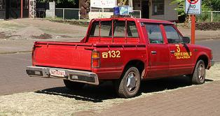
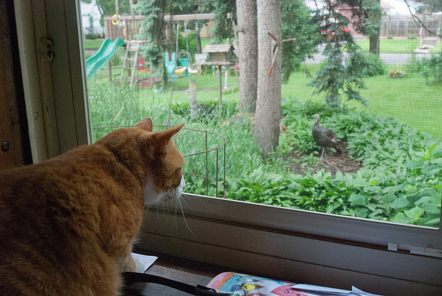
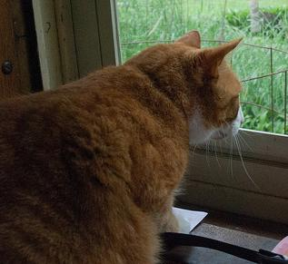

  

<h1 style="font-size: 50px" align="center">COCO CROPPER</h1>

### Crops annotations (bounding boxes) in COCO dataset.

 

# Configurables:
- ### Margin 
    - with what margin the photo is going to be cropped
- ### Minimum area 
    - minimum wanted area of the cropped photo in pixels (width*height)
- ### Minimum width
    - minimum wanted width of the cropped photo in pixels
- ### Minimum height
    - minimum wanted height of the cropped photo in pixels
- ### Classes
    - which classes are wanted among all dataset

 

# Examples

- ### Below examples have been created with the following configuration:
    - margin = 0.12 (%)
    - min_area = 16384 (pixels)
    - min_width = 96 (pixels)
    - min_height = 96 (pixels)

### Input 1

### Output 1 - Vehicle

### Input 2

### Output 2 - Animal

### Input 3

### Output 3 - Person

### Output 3 - Outdoor

  

# Usage

#### 0-) Download the COCO dataset with the annotations json from below link if you do not have them yet:
    https://cocodataset.org/#download

#### 1-) Clone this repository:
    git clone https://github.com/senceryucel/coco-cropper

#### 2-) Navigate into the folder:
    cd coco-cropper
    
#### 3-) Download prerequisites:
    python3 -m pip install -r requirements.txt
    
#### 4-) Run the script with the -h flag to see how to configure it: 
    python3 src/main.py -h

 

### Example usage
    python3 src/main.py -ij ~/path_to/instances_train2017.json -id ~/path_to/train2017 -o ~/path_to/outputs/ -m 0.12 -ma 16384 -mw 96 -mh 96 -c all

 

***
###### Sencer Yucel, 2023